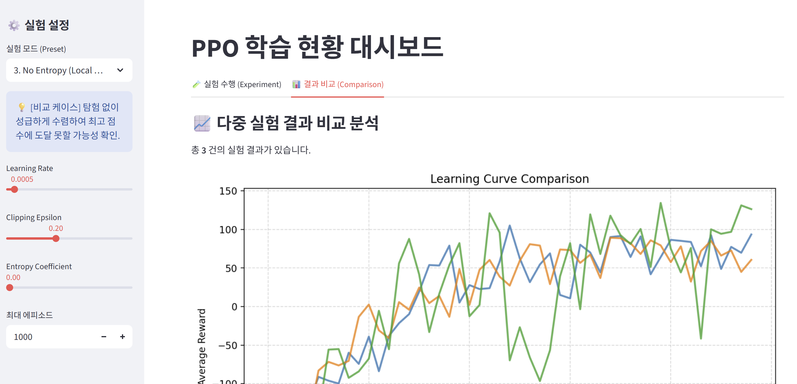

# PPO Implementation & Hyperparameter Sensitivity Analysis on LunarLander-v2

본 프로젝트는 서강대학교 강화학습 프로젝트 과제의 일환으로, **PPO(Proximal Policy Optimization)** 알고리즘을 구현하여 **LunarLander-v2** 환경을 해결하고, 주요 Hyperparameter(Clipping $\epsilon$, Entropy Coefficient)가 학습 안정성에 미치는 영향을 분석합니다.

## 👨‍🎓 Project Member
* **소속:** 서강대학교 AI·SW대학원
* **Role:** 1인 프로젝트 (알고리즘 구현, 실험 설계, 결과 분석, 보고서 작성 전체 수행)

---

## 🎯 Project Goal
1.  **Paper Reproduction:** PPO 논문(Schulman et al., 2017)의 핵심 알고리즘(Clipped Surrogate Objective)을 직접 구현하여 성능을 재연합니다.
2.  **Hyperparameter Study:** 논문에서 제시한 기본 설정 외에, `Clipping Range`와 `Entropy Coefficient`를 변화시켰을 때 학습 곡선(Learning Curve)이 어떻게 달라지는지 비교 실험합니다.
3.  **Real-time Monitoring:** Streamlit을 활용하여 웹 브라우저에서 실시간으로 학습 현황을 시각화합니다.

---

## 📂 File Structure
프로젝트는 모듈화된 구조로 작성되었습니다.

```bash
📦 RL_Project_PPO
 ┣ 📜 app.py           # [Main] Streamlit 웹 대시보드 실행 및 UI 관리
 ┣ 📜 trainer.py       # 학습 루프 및 제너레이터 로직
 ┣ 📜 ppo_agent.py     # PPO 알고리즘 클래스 및 신경망 정의
 ┣ 📜 config.py        # 하이퍼파라미터 설정 및 실험 프리셋(Presets) 관리
 ┣ 📜 ui.png           # README용 예시 스크린샷 이미지
 ┗ 📜 README.md        # 프로젝트 설명 및 실행 가이드
```
---

## ⚙️ Installation & Requirements

본 프로젝트는 **Python 3.8+** 환경에서 동작하며, `Gymnasium (Box2D)` 환경이 필요합니다.

### 1. 필수 라이브러리 설치
```bash
pip install gymnasium[box2d] torch numpy pandas streamlit
```

### 2. (Windows 사용자) Box2D 설치 에러 시
Windows 환경에서 `gymnasium[box2d]` 설치 중 에러가 발생할 경우, Conda를 통해 필요한 패키지를 먼저 설치해주세요.
```bash
conda install -c conda-forge swig
conda install -c conda-forge box2d-py
pip install gymnasium[box2d]
```
---

## 🚀 How to Run (Execution)
Streamlit을 사용하여 대시보드를 실행합니다.

```bash
streamlit run app.py
```
1.  명령어 실행 후 브라우저가 자동으로 열립니다. (주소: `http://localhost:8501`)
2.  좌측 사이드바(Sidebar)에서 **실험 모드(Preset)**를 선택합니다.
    * `1. Baseline`: 논문 권장 설정 (안정적)
    * `2. High Clipping`: Clipping $\epsilon=0.5$ (불안정성 테스트)
    * `3. High Entropy`: 탐험 비중 강화
3.  **"🔥 학습 시작 (Start Training)"** 버튼을 클릭하면 학습이 시작됩니다.
4.  중앙 화면에서 실시간으로 그려지는 **Average Reward 그래프**를 확인합니다.

---

### 🖥️ Dashboard UI Example
실시간 학습 모니터링 및 결과 비교 화면 예시



---

## 🧪 Experiments & Presets
다양한 조건에서의 성능 변화를 관찰하기 위해 3가지 실험 프리셋을 구성하였습니다.

| Preset Name | Epsilon ($\epsilon$) | Entropy Coef | Learning Rate | Description |
| :--- | :---: | :---: | :---: | :--- |
| **1. Baseline** | 0.2 | 0.01 | 0.0005 | PPO 논문의 권장 값. 가장 안정적인 수렴을 기대함. |
| **2. High Clipping** | **0.5** | 0.01 | 0.0005 | Policy Update 폭을 크게 허용하여, 학습 붕괴(Collapse) 가능성을 확인함. |
| **3. High Entropy** | 0.2 | **0.05** | **0.0002** | 탐험(Exploration)을 강제하여 Local Minima 탈출 능력을 테스트함. |

---

## 📊 Evaluation Metric
* **Solved Condition:** `LunarLander-v2` 환경은 평균 점수 **200점 이상** 도달 시 해결된 것으로 간주합니다.
* **Result Visualization:** 학습 진행에 따른 최근 20 에피소드의 평균 보상(Average Reward)을 그래프로 시각화하여 성능을 비교 분석했습니다.

---

## 📝 References
* Schulman, J., et al. "Proximal policy optimization algorithms." arXiv preprint arXiv:1707.06347 (2017).
* OpenAI Gymnasium Documentation: https://gymnasium.farama.org/environments/box2d/lunar_lander/